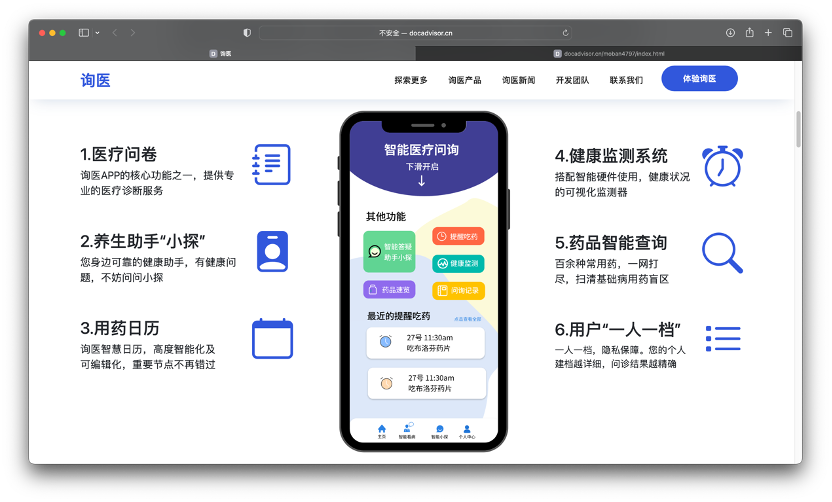
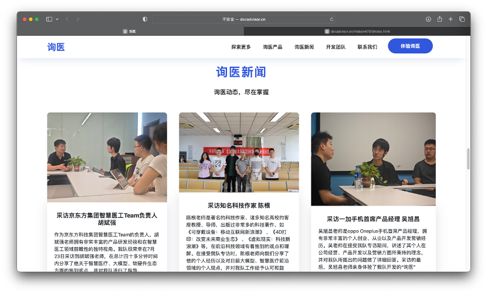
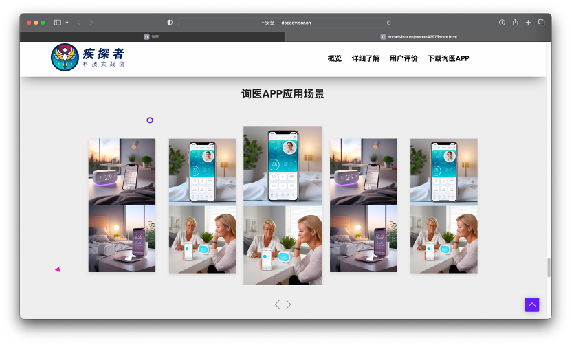
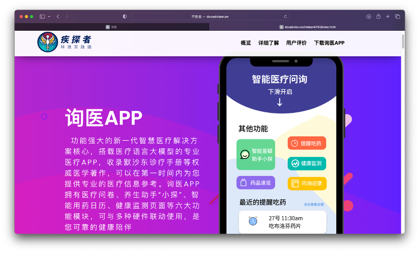

# DocAdvisor Website (Frontend) — Product Landing Site for an AI Healthcare Platform Concept

> **DocAdvisor (询医)** is a product concept exploring how **AI-driven medical consultation** and **digital healthcare experiences** can improve public health awareness and accessibility.  
> This repository focuses on the **DocAdvisor official website frontend** — a polished, responsive, media-rich landing site built with **HTML, CSS, and JavaScript** to showcase my **frontend engineering** and **product storytelling** capabilities.  

---

## Table of Contents

- [Project Overview](#project-overview)
- [Why This Website Matters (Business Value)](#why-this-website-matters-business-value)
- [What This Repository Contains](#what-this-repository-contains)
- [Key Website Sections](#key-website-sections)
- [Tech Stack](#tech-stack)
- [Project Structure](#project-structure)
- [Screenshots](#screenshots)
- [App Demo Video](#app-demo-video)

---

## Project Overview

**DocAdvisor Website** is a product-oriented landing site designed to introduce the DocAdvisor concept in a credible, structured, and recruiter-friendly way.

This site is built to:

- present a clear product value proposition
- communicate features visually and quickly
- build trust through real-world activities/news-style sections
- demonstrate a modern frontend codebase (HTML/CSS/JS)
- support a “click-and-understand” experience for HR / interviewers

While DocAdvisor as a broader concept includes AI + mobile app + smart hardware scenarios, this repository is **primarily the frontend website implementation** that showcases my web development ability and product thinking.  

---

## Why This Website Matters (Business Value)

Healthcare and wellness face persistent challenges:

- **Overwork-related health risks** are increasingly common and often ignored until severe outcomes occur.  
- **Medical resources are scarce and unevenly distributed**, creating congestion in major hospitals and under-utilization elsewhere.  
- **Low adoption of health apps** is driven by concerns about professionalism, usability, and privacy.  

A well-designed product website plays a real commercial role:

- **User acquisition:** first-touch conversion for new users
- **Trust building:** credibility through structured explanations and visual evidence
- **Partner communication:** easier storytelling for stakeholders (hospitals, enterprises, communities)
- **Recruiter evaluation:** immediate proof of frontend + product capabilities

This repository therefore demonstrates not only coding, but also **how to present a tech product professionally** — the same skill used in real companies shipping real products.

---

## What This Repository Contains

This repo is a **frontend-only** website codebase, focusing on:

- **Semantic HTML5 structure**
- **Modular CSS (layout + responsive + third-party styles)**
- **JavaScript-driven UI behaviors**
- **Responsive layout and modern UI composition**
- **Media content integration** (screenshots + demo video)
- **Product storytelling flow** (hero → features → scenarios → team → CTA)

If you are a recruiter or interviewer, this project is intentionally designed to be:

- **easy to review**
- **quick to understand**
- **visually convincing**
- **technically clear**

---

## Key Website Sections

Typical sections included in the DocAdvisor website:

1. **Hero / Product Positioning**
   - clear headline and product concept
   - CTA buttons to guide exploration

2. **Feature Highlights**
   - structured presentation of key modules
   - icon-driven explanations for quick reading

3. **News / Updates**
   - credibility section showing activities, interviews, and project progress

4. **Application Scenarios**
   - user-centric scene-based storytelling
   - demonstrates real-world usage contexts

5. **App Introduction**
   - bridges website to mobile product vision
   - supports cross-platform product narrative

6. **Team Introduction**
   - adds authenticity and “startup product” feel
   - communicates collaborative project identity

---

## Tech Stack

### Core

- **HTML5** — semantic layout & structure
- **CSS3** — styling, layout, animation, responsiveness
- **JavaScript (ES6)** — interactions and UI behaviors

### Frontend Engineering Focus

- responsive design & layout organization
- readable and maintainable stylesheet structure
- consistent UI spacing and visual hierarchy
- scalable asset management

---

## Project Structure

Recommended / clean structure:

```text
docadvisor-web/
├── index.html                  # Main entry (recommended for GitHub Pages)
├── README.md
├── LICENSE
├── css/
│   ├── style.css
│   ├── responsive.css
│   ├── animate.css
│   ├── bootstrap.min.css
│   ├── font-awesome.min.css
│   ├── owl.carousel.min.css
│   ├── owl.theme.default.min.css
│   └── themify-icons.css
├── js/
│   └── main.js                 # Main JS logic (rename if needed)
└── assets/
    ├── images/
    │   ├── Web-mainpage01.png
    │   ├── Web-mainpage03.png
    │   ├── Web-News.png
    │   ├── Web-ScenarioCase.png
    │   ├── Web-mianpae-02.png
    │   └── Web-TeamIntro.png
    └── video/
        └── docadvisor-app-demo.mp4
```

**Important:** If your entry file is currently `mainpage.html`, you can either:

- rename it to `index.html` (recommended), or
- keep it and configure GitHub Pages accordingly.

Also ensure your HTML uses correct paths after organizing folders:

- CSS: `href="css/style.css"`
- JS: `src="js/main.js"`

---


## 📸 Website Screenshots

### 1️⃣ Homepage – Intelligent Healthcare Solution


---

### 2️⃣ Feature Overview


---

### 3️⃣ News & Updates Section


---

### 4️⃣ Application Scenarios


---

### 5️⃣ App Introduction Page


---

### 6️⃣ Development Team Section


---

## App Demo Video

This repository supports including a product demo video (recommended for fast reviewer understanding).

Click below to watch the demo video:

[▶ Watch DocAdvisor App Demo](video/DocAdvisor%20App%20Video.mp4)

 

