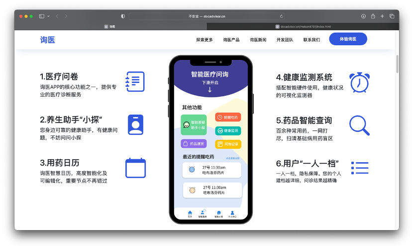
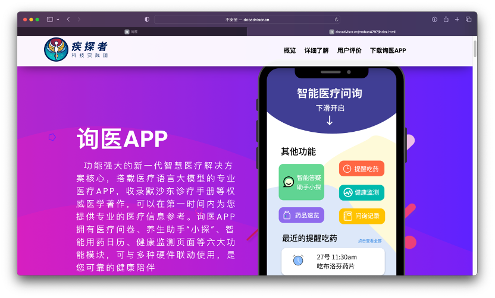

# DocAdvisor (询医) — AI-Enabled Healthcare Product Prototype  
### Product Website, Technical Snapshots, and Portfolio Showcase

> **DocAdvisor** is an AI-enabled healthcare product prototype designed to explore how intelligent consultation, digital health records, and multi-platform user experiences can make healthcare guidance more accessible, efficient, and user-centric.  
>
> This repository brings together:
> - a **polished frontend landing site** built independently to communicate the product vision clearly and professionally
> - selected **Android and Django code snapshots** from the broader prototype to demonstrate how core user authentication and data structures were implemented
> - a portfolio-ready presentation of my ability to combine **product thinking, leadership, technical execution, and business storytelling** in one project

---

## Table of Contents

- [Project Overview](#project-overview)
- [Why This Project Matters](#why-this-project-matters)
  - [Business Value](#business-value)
  - [Social Impact](#social-impact)
  - [Technical Significance](#technical-significance)
- [My Role and Contribution](#my-role-and-contribution)
- [What This Repository Contains](#what-this-repository-contains)
- [Implementation Highlights](#implementation-highlights)
  - [Frontend Website](#frontend-website)
  - [Android Authentication Snapshot](#android-authentication-snapshot)
  - [Backend Authentication Snapshot](#backend-authentication-snapshot)
- [Tech Stack](#tech-stack)
- [Project Structure](#project-structure)
- [Screenshots](#screenshots)
- [App Demo Video](#app-demo-video)
- [How to View This Project](#how-to-view-this-project)
- [Why This Project Is Relevant to My Portfolio](#why-this-project-is-relevant-to-my-portfolio)
- [Author](#author)
- [Note](#note)

---

## Project Overview

**DocAdvisor** was conceived as a **digital healthcare solution** that could improve the way people access preliminary health guidance, understand their health information, and interact with healthcare-related services across web and mobile touchpoints.

The broader concept combined:

- **AI-assisted medical consultation**
- **mobile-first user interaction**
- **user account and health information management**
- **conversation history and health data integration**
- **a public-facing digital presence to communicate trust, usability, and product value**

This repository is not just a collection of files. It is a **curated portfolio presentation** of the DocAdvisor project, showing both:

1. the **product-facing side** through a responsive website, and  
2. the **implementation side** through selected technical snapshots from the original prototype.

It is designed to show how I can contribute not only as a developer, but also as someone who can help shape a product from **strategy and positioning** through to **execution and presentation**.

---

## Why This Project Matters

### Business Value

Healthcare is one of the clearest examples of a sector where digital solutions can create value at multiple levels.

DocAdvisor was built around the idea that better healthcare products should not only function technically, but also solve real business and operational problems such as:

- **high friction in early-stage healthcare access**
- **inefficient use of medical resources**
- **poor user engagement with health applications**
- **low trust in unfamiliar digital health tools**
- **difficulty translating technical capability into a credible user-facing product**

From a business perspective, this project demonstrates how a digital product can create value by:

- **improving user acquisition** through clear and persuasive product communication
- **building trust** with structured feature explanations, scenarios, and visual evidence
- **supporting stakeholder communication** by translating technical functionality into a compelling product narrative
- **connecting product design with commercial positioning**, rather than treating technology as an isolated asset
- **showing how AI can be productised**, not just prototyped

In other words, this project is not only about building pages or writing code. It is about demonstrating how a digital solution can be positioned in a way that supports **adoption, credibility, and long-term value creation**.

---

### Social Impact

DocAdvisor was also motivated by a broader public-interest question:

> How can digital technology make healthcare support more accessible, understandable, and approachable for ordinary users?

The social significance of the concept lies in several areas:

- helping users access **preliminary guidance more conveniently**
- improving **health awareness and engagement**
- reducing barriers created by **information asymmetry**
- supporting more user-friendly interaction with health-related services
- exploring how AI and digital interfaces can contribute to **more inclusive healthcare experiences**

While this repository presents a prototype rather than a production healthcare system, the underlying vision reflects a meaningful social direction: using digital tools to improve **accessibility, awareness, and user empowerment** in health contexts.

---

### Technical Significance

From a technical standpoint, DocAdvisor is valuable because it is **multi-layered**.

Rather than being a single static webpage or a purely conceptual idea, the broader project involved:

- a **frontend website** for product communication and user-facing presentation
- an **Android-side authentication flow** with client-server communication
- a **Django backend snapshot** for account logic and data modelling
- structured handling of **user information, conversation history, and health-related data**

This makes the project significant from a portfolio perspective because it demonstrates exposure to:

- **multi-platform product design**
- **client-server interaction**
- **user authentication logic**
- **data modelling for real-world product scenarios**
- **the translation of technical systems into understandable product experiences**

For my portfolio, the technical meaning is not that I am claiming to be a specialist backend engineer.  
Instead, it shows that I can understand and contribute to a broader system while also excelling at the part I independently owned most strongly: **turning a technical concept into a professional, credible, and user-ready product presentation**.

---

## My Role and Contribution

This project is especially meaningful to me because it reflects both **leadership** and **execution**.

### Leadership and Strategic Contribution

In the broader DocAdvisor project, I played an important role in helping drive the direction of the work by contributing to:

- **overall project positioning and concept framing**
- **solution planning and key design direction**
- **high-level feature and presentation strategy**
- **team coordination and structured delivery**
- **turning a technical idea into a product narrative that others could understand and support**

In practical terms, this means I was not only participating in implementation, but also helping shape the **big-picture direction** of what the team was building and how it should be presented.

### Technical and Delivery Contribution

Alongside that strategic involvement, I also contributed directly to development and portfolio execution, including:

- participating in the broader product development effort with the team
- contributing to the technical implementation context reflected in the authentication and data-structure snapshots
- **independently building the full product website frontend** using **HTML, CSS, and JavaScript**
- organising the repository in a way that clearly separates product-facing and implementation-facing assets
- turning a complex student innovation project into a **clean, recruiter-friendly GitHub showcase**

This combination of **leadership, planning, collaboration, and independent delivery** is one of the main reasons I consider this project highly representative of my value.

---

## What This Repository Contains

This repository contains two complementary layers of the DocAdvisor project.

### 1. Product-facing layer

The `frontend/` folder contains the website implementation used to present the product concept in a polished and accessible way.

This highlights my ability to:

- communicate product value clearly
- design a coherent user-facing experience
- build responsive and media-rich web interfaces
- structure technical work for external audiences such as recruiters, judges, and stakeholders

### 2. Implementation-facing layer

The `code-snapshots/` folder contains selected code excerpts from the broader prototype, focused on the **core user authentication flow** and **backend data modelling**.

These are included to demonstrate that the project extended beyond presentation into actual implementation logic.

Importantly, these snapshots are presented as **selected engineering components from a broader team project**, rather than as a full production-ready backend system.

---

## Implementation Highlights

## Frontend Website

The website serves as the public-facing layer of the DocAdvisor concept.

Its purpose is to:

- introduce the product clearly
- explain key features and user scenarios
- establish trust through structured storytelling
- provide a visually credible and professional product presentation
- support fast understanding for recruiters, collaborators, and stakeholders

This was the part I **independently completed**, and it is the strongest direct reflection of my frontend execution and product communication ability.

---

## Android Authentication Snapshot

The `code-snapshots/android-auth/` folder contains selected Android-side code showing how the prototype handled core user authentication logic.

This includes examples of:

- login flow handling
- client-server communication
- callback-based response handling
- basic error-state management
- integration between UI interaction and backend authentication endpoints

These files help demonstrate that the product concept had real implementation depth beyond the landing site.

---

## Backend Authentication Snapshot

The `code-snapshots/backend-auth/` folder contains selected Django-side code illustrating:

- authentication endpoint logic
- account management flow
- URL routing
- data models for users, conversation history, and health-related records

This part is included as a **backend snapshot**, showing the system thinking behind the product without overstating the repository as a full standalone backend project.

---

## Tech Stack

### Frontend

- **HTML5**
- **CSS3**
- **JavaScript**

### Technical Snapshot Stack

- **Android / Java**
- **Django / Python**
- **SQLite-style relational data modelling concepts**
- **Client-server interaction design**

### Portfolio Strengths Demonstrated

- product thinking
- frontend development
- solution framing
- technical communication
- repository organisation
- collaborative project delivery
- business-oriented storytelling

---

## Project Structure

```text
docadvisor-web/
├── frontend/
│   ├── css/
│   ├── html/
│   ├── image/
│   ├── js/
│   ├── video/
│   └── .gitkeep
│
├── code-snapshots/
│   ├── android-auth/
│   │   ├── LoginActivity.java
│   │   ├── UserDataCommunication.java
│   │   └── UserRunnables.java
│   │
│   └── backend-auth/
│       ├── models.py
│       ├── urls.py
│       └── views.py
│
├── .gitignore
├── LICENSE
└── README.md

```


### Screenshots

### 1️⃣ Homepage – Intelligent Healthcare Solution


---

### 2️⃣ Feature Overview



---

### 3️⃣ News & Updates Section


---

### 4️⃣ Application Scenarios


---

### 5️⃣ App Introduction Page



---

### 6️⃣ Development Team Section


---

## App Demo Video

A short product demo video is included to help reviewers understand the mobile concept more quickly.

[▶ Watch DocAdvisor App Demo](frontend/video/DocAdvisor%20App%20Video.mp4)

---

## How to View This Project

### View the website locally

Open the main HTML file in your browser from the `frontend/` directory.

### Explore implementation snapshots

Browse:

- `code-snapshots/android-auth/`
- `code-snapshots/backend-auth/`

These folders contain selected technical examples from the original prototype.

---

## Why This Project Is Relevant to My Portfolio

This project is a strong representation of the kind of value I aim to bring in digital, analytics, and technology-focused roles.

It shows that I can:

- **lead and help shape a project at the strategic level**
- **translate a broad concept into a structured solution direction**
- **work effectively in a team-based product environment**
- **contribute to technical implementation**
- **independently deliver polished frontend outputs**
- **connect technical work with business value and user impact**
- **present a product in a way that is commercially credible, socially meaningful, and technically grounded**

For me, that combination matters more than simply showing isolated code snippets.  
It reflects the broader capability to move between **strategy, product, communication, and implementation** — which is exactly the kind of capability I want my GitHub profile to communicate.

---

## Author

**Di Lu**  
Bachelor of Commerce, Information Systems & Business Analytics  
University of Auckland

### Connect with Me

- **LinkedIn:** [Di Lu](https://www.linkedin.com/in/di-lu-3572912b5)
- **Email:** dilu.connect@gmail.com

---

## Note

This repository includes:

- a frontend website independently built for portfolio and product presentation purposes
- selected technical snapshots from the broader DocAdvisor prototype to illustrate representative implementation components

It is intended to present the project in a clean, professional, and reviewer-friendly format while accurately reflecting both **team collaboration** and **individual contribution**.
